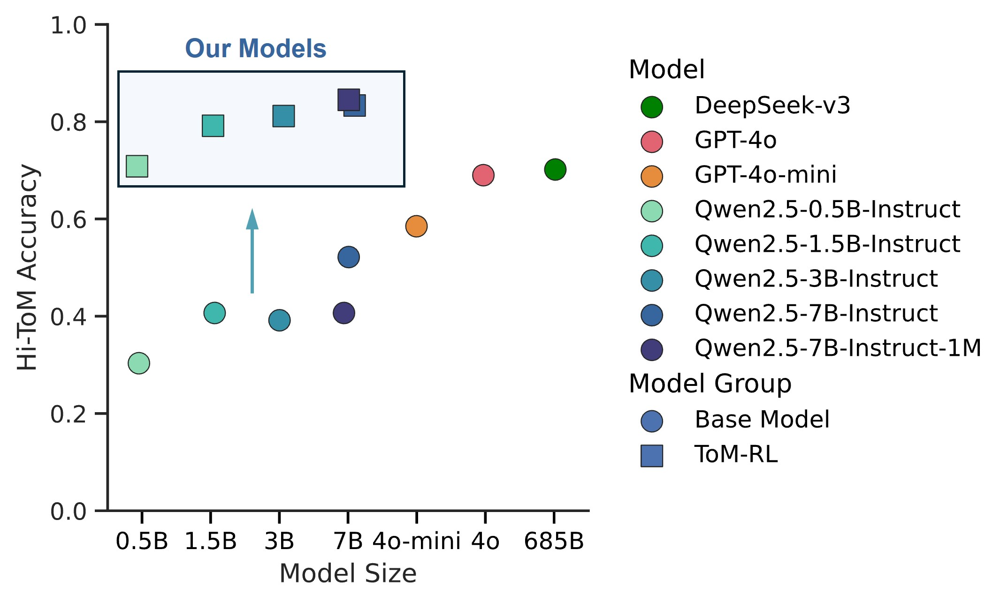

# TomRL: Reinforcement Learning Unlocks Theory of Mind in Small LLMs

[](https://arxiv.org/abs/2504.01698)

<p align="center">
  
  <br>
  <em>Hi-ToM Accuracy vs Model Size</em>
</p>

## Benchmark Results

| Model                           | Hi-ToM   | 4th-order ToM | ToMi    | ExploreToM | ExploreToM (Infilled) |
|--------------------------------|----------|----------------|---------|------------|------------------------|
| DeepSeek-v3                    | **70.17%** | **58.67%**     | 57.17%  | 65.01%     | 64.73%                 |
| GPT-4o                         | 69.00%   | 46.17%         | 61.96%  | 67.35%     | 62.48%                 |
| GPT-4o-mini                    | 58.50%   | 30.50%         | **70.64%**  | **69.32%**     | **66.04%**                 |
| Qwen2.5-0.5B-Instruct          | 30.33%   | 23.83%         | 29.38%  | 60.51%     | 54.97%                 |
| Qwen2.5-1.5B-Instruct          | 40.67%   | 25.17%         | 54.12%  | 54.78%     | 43.53%                 |
| Qwen2.5-3B-Instruct            | 39.17%   | 27.50%         | 47.78%  | 47.37%     | 49.81%                 |
| Qwen2.5-7B-Instruct            | 52.17%   | 28.83%         | 54.65%  | 59.38%     | 45.40%                 |
| Qwen2.5-7B-Instruct-1M         | 40.67%   | 17.83%         | 54.85%  | 37.34%     | 41.46%                 |
| **Qwen2.5-0.5B-Instruct (RL)**     | 70.83%   | 85.83%         | 54.25%  | **93.34%**     | 72.61%                 |
| **Qwen2.5-1.5B-Instruct (RL)**     | 79.17%   | 89.33%         | 75.89%  | 90.06%     | 70.73%                 |
| **Qwen2.5-3B-Instruct (RL)**       | 81.17%   | 88.17%         | **80.18%**  | **93.43%**     | **78.14%**                 |
| **Qwen2.5-7B-Instruct (RL)**       | 83.33%   | 82.83%         | 73.99%  | 91.65%     | 74.77%                 |
| **Qwen2.5-7B-Instruct-1M (RL)**    | **84.50%** | **94.50%**     | **81.08%**  | 92.31%     | 77.20%                 |

## Installation

```bash
conda create -n tom python=3.10
conda activate tom
pip install torch==2.4.0 --index-url https://download.pytorch.org/whl/cu121
pip3 install vllm==0.6.3 ray
pip3 install flash-attn --no-build-isolation
pip install -e .  # For verl integration
pip install wandb IPython matplotlib
```

## Data Preparation

### Scaling the Hi-ToM Dataset

- Based on the [hi-tom dataset](https://github.com/ying-hui-he/Hi-ToM_dataset)
- Modified the `generate_tomh.sh` from 20×2×3×5 (600) to 100×2×3×5 (3000)

```shell
# Generate data
python create_world.py
python generate_tasks.py -w world_large.txt -n 100 -ptn=0.1
python generate_tasks.py -w world_large.txt -n 100 -ptn=0.1 --tell True
python generate_prompts.py
```

### Training/Evaluation Dataset Structure

- Data preprocessing: `./examples/data_preprocess/merge_tom.py`
- Dataset location: `./data/cleaned_tom`
  - Training: `ToM_train_HiEx_hint.parquet` (3200)
    - 2k from hi_tom
    - 1.2k from explore_tom
  - Evaluation: `ToM_test_HiExTi_hint.parquet` (8060)
    - 1000 from hi_tom
    - 5994 from tomi
    - 1066 from explore_tom (structured version)

## Training

```bash
conda activate tom
bash tom_grpo.sh  # 4×A100 80G
```

## Evaluation

Evaluation datasets are stored in `./eval_tom/tom_eval_datasets.csv` and include:
- Hi-ToM: 600 samples
- 4th-order ToM: 600 samples
- ToMi: 5994 samples
- ExploreToM (structured version): 1066 samples
- ExploreToM (infilled version): 1066 samples

## Citation

```bibtex
@online{luToMRLReinforcementLearning2025,
  title = {{{ToM-RL}}: {{Reinforcement Learning Unlocks Theory}} of {{Mind}} in {{Small LLMs}}},
  shorttitle = {{{ToM-RL}}},
  author = {Lu, Yi-Long and Zhang, Chunhui and Song, Jiajun and Fan, Lifeng and Wang, Wei},
  date = {2025-04-02},
  eprint = {2504.01698},
  eprinttype = {arXiv},
  eprintclass = {cs},
  doi = {10.48550/arXiv.2504.01698},
  url = {http://arxiv.org/abs/2504.01698}
}
```

## Acknowledgements

- [Logic-RL](https://github.com/Unakar/Logic-RL.git) 🔗
- [Verl](https://github.com/volcengine/verl) 🔗
- [TinyZero](https://github.com/Jiayi-Pan/TinyZero) 🔗
- [Qwen2.5 series models](https://huggingface.co/collections/Qwen/qwen25-66e81a666513e518adb90d9e) 🔗